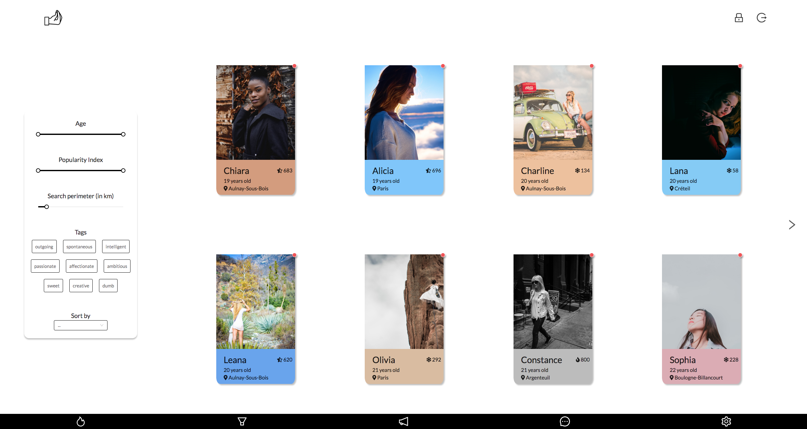

# Matcha
[42 Project] - Second project of the web branch

## Project description
*This project is about creating an app allowing two potential lovers to meet, from the registration to the final encounter. A user will then be able to register, connect, fill his/her profile, search and look into the profile of other users, like them, chat with those that “liked” back.*

## Stack
* Express.js
* React.js
* PostgreSQL
* Docker

## Screenshots

